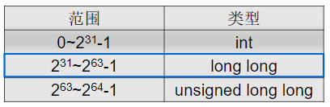

# 计算机系统基础(一)：程序的表示、转换与链接

## 1. 计算机系统概述

**系统思维**

- 从**计算机系统**角度出发分析问题和解决问题
- 首选取决于对计算机系统有多了解，“**知其然并知其所以然**”
  - 高级语言都要转换为机器指令才能在计算机上执行
  - 机器指令是一串0/1序列，能被机器直接理解并执行
  - 计算机系统是模运算系统，字长有限，高位被丢弃
  - 运算器不知道参加运算的是带符号数还是无符号数
  - 在计算机世界，`x*y`可能小于0，(x+y)+z不一定等于x+(y+z)
  - 访问内存需要几十到几百个时钟，而访问磁盘要几百万个时钟
  - 进程具有独立的逻辑控制流和独立的地址空间
  - 过程调用使用栈存放参数和局部变量等，递归过程有大量额外指令，增加时间开销，并可能发生栈溢出

计算机系统抽象层的转换


课程目标：使学生清楚计算机是如何生成和运行可执行文件的！

重点在高级语言以下各抽象层

- C语言程序设计层
  - 数据的机器级表示、运算
  - 语句和过程调用的机器级表示
- 操作系统、编译和链接的部分内容
- 指令集体系结构（ISA）和汇编层
  - 指令系统、机器代码、汇编语言
- 微体系结构及硬件层
  - CPU的通用结构
  - 层次结构存储系统

### 计算机系统基本组成与基本功能

1946年，第1台**通用**电子计算机 `ENIAC`诞生

- `Electronic Numerical Integrator And Computer`电子数字积分计算机
- 由电子真空管组成
- 美国宾夕法尼亚大学研制
- 用于解决复杂弹道计算问题
- 500次加法/s
- 平方、立方、sin、cos等
- 用**十进制**表示信息并运算
- 采用**手动编程**，通过设置开关和插拔电缆来实现

**冯·诺伊曼结构的基本思想**

- 1945年，冯·诺伊曼以“关于EDVAC的报告草案”为题，发表了全新的“**存储程序通用电子计算机方案**”`Electronic Discrete Variable Automatic Computer`
- 1946年，普林斯顿高等研究院(`the Instutute for Advance Study at Princeton, IAS`)开始设计“**存储程序**”计算机，被称为IAS计算机。

|  |  |
| --------------------------------------- | --------------------------------------- |
|  |  |

- 早期，部件之间用**分散方式**相连
- 现在，部件之间大多用**总线方式相连**

冯·诺伊曼结构的主要思想

1. 计算机由**运算器、控制器、存储器、输入设备和输出设备**五个基本部件组成
2. 各基本部件的功能是：
   - 存储器不仅能存放数据，而且也能存放指令，形式上两者没有区别，但计算机应能区分数据还是指令
   - 控制器应能自动取出指令执行
   - 运算器应能进行加/减/乘/除四种基本算术运算，并且也能进行一些逻辑运算和附加运算
   - 操作人员可以通过输入设备、输出设备和主机进行通信
3. 内部以**二进制**表示指令和数据。**每条指令由操作码和地址码两部分组成**。操作码指出操作类型，地址码指出操作数的地址。由一串指令组成程序。
4. 采用“**存储程序**”工作方式

**现代计算机结构模型**

|  |  |
| --------------------------------------- | --------------------------------------- |

**指令和数据**

- **程序启动前**，指令和数据都存放在存储器中，形式上没有差别，都是0/1序列
- 采用“**存储程序**”工作方式：
  - 程序由指令组成，程序被启动后，计算机能自动取出一条一条指令执行，在执行过程中无需人的干预
- **指令执行过程中**，指令和数据被从存储器取到CPU，存放在CPU内的寄存器，指令在IR中，数据在CPR中。
- **指令中需给出的信息：**
  - **操作性质（操作码）**
  - **源操作数1 或/和 源操作数2（立即数、寄存器编号、存储地址）**
  - **目的操作数地址（寄存器编号、存储地址）**
  - 存储地址的描述与**操作数的数据结构**有关！

**计算机的基本组成与基本功能**

- 什么是计算机？
  - 计算机是一种能对数字化信息进行自动、告诉算术和逻辑运算的处理装置
- 计算机的基本部件及功能
  - 运算器（数据运算）：ALU、GPRs、标志寄存器等
  - 存储器（数据存储）：存储阵列、地址译码器、读写控制电路
  - 总线（数据传送）：数据（MDR）、地址（MAR）和控制总线
  - **控制器（控制）：对指令译码生成控制信号**
- 计算机实现的所有任务都是通过执行一条一条指令完成的！

### 程序开发和执行

**最早的程序开发过程**

- 用机器语言编写程序，并记录在纸带或卡片上
  - 穿孔表示0，未穿孔表示1
  - 输入：按钮、开关；
  - 输出：指示灯等
  - 所有信息都是0/1序列

|  |  | 前4位为操作码<br />后4位表示操作地址<br />0101：add<br />0010：跳转<br />0110：sub |
| --------------------------------------- | --------------------------------------- | ---------------------------------------------------------------------------------- |

**汇编语言程序开发过程**

|  |  |
| --------------------------------------- | --------------------------------------- |

- 用**符号**表示跳转位置和变量位置，简化问题
- 于是，汇编语言出现

  - 用**助记符**表示操作码
  - 用**标号**表示位置
  - 用助记符表示寄存器
  - ...
- 汇编语言编写的优点：

  - **不会因为增减指令而需要修改其他指令**
  - 不需记忆指令编码，编写方便
  - 可读性比机器语言强
- 带来新的问题：

  - 人容易了，机器并不认实这些指令
  - **需将汇编语言转换为机器语言**！用**汇编程序**转换

进一步认识机器级语言

- 汇编语言(源)程序由汇编指令构成
- 什么是**汇编指令**？
  - **用助记符和标号来表示的指令（与机器指令一一对应）**
- **指令**又是什么呢？
  - 包含操作码和操作数或其他地址码（机器指令用二进制表示，汇编指令用符号表示）
  - 只能描述：
    - 取（或存一个数）
    - 两个数加（或减、乘、除、与、或等）
    - 根据运算结果判断是否转移执行
  - 
    - `Ld`：Load从存储单元中将数据**加载/装入**到寄存器
    - `St`：Store将寄存器中的数据**存储**到存储单元
- 用**汇编语言**编写复杂程序
  - 需要描述的细节太多！程序会很长！而且在不同结构的机器上就不能运行！
- 结论：
  - **机器语言和汇编语言都是面向机器结构的语言，故它们统称为机器级语言**
  - 用汇编语言比机器语言好，但是，还是很麻烦！

**用高级语言开发程序**

- 随着技术的发展，出现了许多高级编程语言
  - 它们**与具体机器结构无关**
  - **面向算法描述**，比机器语言描述能力强得多
  - 高级语言中一条语句对应几条、几十条甚至几百条指令
  - 有“面向过程”和“面向对象”的语言之分
  - 处理逻辑分为三种结构
    - **顺序结构、选择结构、循环结构**
  - 有两种转换方式：**“编译”和“解释”**
    - **编译程序(Complier)：将高级语言源程序转换为机器级目标程序，执行时只要启动目标程序即可**
    - **解释程序(Interpreter)：将高级语言语句逐条翻译乘机器语言并立即执行，不生成目标文件。**

**Hello程序的启动和执行过程**

经典的 `hello.c` C-源程序

```c
#include <stdio.h>
int main()
{
    printf("hello, world\n");
}

/* GCC+Linux平台中的处理过程 */
/*
                                              printf.o
                                                      \ 链接(ld)
hello.c -----> hello.i -----> hello.s -------> hello.o ---------> hello
源程序   预处理  源程序  编译  汇编语言程序 汇编 可重定向目标程序 可执行目标程序
(文本)   (cpp)  (文本)  (cc1)  (文本)     (as)  (二进制)         (二进制)

*/
```

|  |  |
| --------------------------------------- | --------------------------------------- |


**不同层次语言之间的等价关系**

**任何高级语言程序最终通过执行若干条指令来完成！**

|  |  |
| --------------------------------------- | --------------------------------------- |

**开发和运行程序需要什么支撑？**

- 最早的程序开发很简单
  - 直接输入指令和数据，启动后把第一条指令地址送PC开始执行
- 用高级语言开发程序需要复杂的支撑环境
  - 语言处理程序
    - 需要**编辑器**编写程序
    - 需要一套翻译转换软件处理各类源程序
      - 编译方式：预处理程序、编译器、汇编器、链接器
      - 解释方式：解释程序
    - `语言处理程序 + 语言的运行时系统 = 语言处理系统`
  - 人机接口
    - 需要一个可以执行程序的界面（环境）
      - GUI方式：图形用户界面
      - CUI方式：命令行用户界面
    - `人机接口 + 操作系统内核 = 操作系统`
- 支撑程序开发和运行的环境由**系统软件**提供
- 最重要的系统软件是**操作系统**和**语言处理系统**
- **语言处理系统运行在操作系统之上，操作系统利用指令管理硬件**

### 计算机系统层次结构

**早期计算机系统的层次**

|  |  |  |
| --------------------------------------- | --------------------------------------- | --------------------------------------- |

可以看出：语言的发展是一个不断“**抽象**”的过程，因而，相应的计算机系统也不断有新的层次出现。

- **语言处理系统**包括：各种**语言处理程序（如编译、汇编、链接）**、**运行时系统（如库函数，调试、优化等功能）**
- **操作系统**包括人机交互界面、提供服务功能的内核例程

**计算机系统抽象层的转换**

|  |  |
| --------------------------------------- | --------------------------------------- |

- 计算机系统抽象层的转换
  - 程序执行结果不仅取决于算法、程序编写，而且取决于语言处理系统、操作系统、ISA、微体系结构
  - 不同计算机课程处于不同层次，必须将各个层次关联起来解决问题
  - **功能转换：上层是下层的抽象，下层是上层的实现。底层为上层提供支撑环境!**
- 计算机系统的不同用户
  - 最终用户工作在由应用程序提供的最上层的抽象层
  - 系统管理员工作在由操作系统提供的抽象层
    - 操作系统通过指令直接对硬件进行编程控制
  - 应用程序员工作在由语言处理系统（主要由编译器和汇编器）的抽象层
    - 语言处理系统建立在操作系统之上
    - 编辑器和汇编器的目标程序由机器级代码组成
  - 系统程序源（实现系统软件）工作在ISA层次，必须对ISA非常了解
    - **ISA处于软件和硬件的交界面（接口）**
    - **ISA是对硬件的抽象**
    - **所有软件功能都建立在ISA之上**

**指令集体系结构（ISA）**

- ISA指 `Instruction Set Architecture`，即**指令集体系结构**，有时简称为**指令系统**
- ISA是一种规约（Specification），规定了如何使用硬件
  - 可执行的指令的集合，包括**指令格式、操作种类**以及每种操作对应的操作数的相应规定
  - 指令可以接受的**操作数的类型**；
  - 操作数所能存放的寄存器组的结构，包括每个**寄存器的名称、编号、长度和用途**；
  - 操作数所能存放的**存储空间的大小和编址方式；**
  - 操作数在存储空间存放时按照**大端还是小端方式存放**
  - 指令获取操作数的方式，即寻址方式；
  - 指令执行过程的控制方式，包括**程序计数器（PC）、条件码定义**等
- ISA在**通用**计算机系统中是必不可少的一个抽象层
  - 没有它，软件无法使用计算机硬件
  - 无它，一台计算机不能称为“通用计算机”
- ISA和计算机组成(Organization，即MicroArchitecture)是何关系？
  - **ISA是计算机组成的抽象**
  - 不同ISA规定的指令集不同，如，IA-32、MIPS、ARM等
  - 计算机组成必须能够实现ISA规定的功能，如提供GPR、标志、运算电路等
  - 同一种ISA可以有不同的计算机组成，如乘法指令可用ALU或乘法器实现

|  |  |
| -------------------------- | -------------------------- |

## 2. 数据的表示和存储

### 数制与编码

|  |  |
| --------------------------------------- | --------------------------------------- |

**信息的二进制编码**

- 机器级数据分两大类
  - 数值数据：无符号整数、带符号整数、浮点数（实数）
  - 非数值数据：逻辑数（包括位串）、西文字符和汉字
- 计算机内部所有信息都用二进制（即：0和1）进行编码
- 用二进制编码的原因
  - 制造2个稳定态的物理器件容器（电位高/低，脉冲有/无，正/负极）
  - 二进制编码、计数、运算规则简单
  - 正好与逻辑命题真/假对应，便于逻辑运算
  - 可方便地用逻辑电路实现算术运算
- **真值和机器数**
  - **机器数：用0和1编码的计算机内部的0/1序列。由符号和数值一起编码表示的二进制数称为机器数或机器码**
  - **真值：真正的值，即：现实中带正负号的数**
  - 例：`unsigned short`型变量x的真值是127，其机器数 `127=2^7-1`，即 `0000 0000 0111 1111`

**数值数据的表示**

- **数值数据表示的三要素**

  - **进位计数制**
  - **定、浮点表示**
  - **如何用二进制编码**
  - 即：要确定一个数值数据的值必须先确定这三个要素
- 进位计数制

  - 十进制，每个数位可用十个不同符号0~9表示，每个符号处于不同位置时，所代表的数值不一样。**“10”称为基数(base)，`10^i`称为第i位上的权。运算时，“逢十进一”。**
  - 二进制，每个数位可用2个不同符号0和1表示。**“2”称为基数(base)，`2^i`称为第i位上的权。运算时，“逢二进一”。后缀“B”表示二进制数，如 `01011010B`**
  - 十六进制和八进制
    - 八进制/十六进制是二进制的简便表示。便于阅读和书写！它们之间对应简单，转换容易。
    - 在机器内部用二进制表示，**在屏幕或其它设备上表示时**，转换为八/十六进制，可缩短长度。
    - 八进制：Octal（用后缀“O”表示）。`2^3=8`，对应3位二进制
    - 十六进制：Hexadecimal（用后缀“H”，或前缀“Ox”表示）。现代计算机系统多用十六进制表示机器数。`2^4=16`，对应4位二进制
- 定/浮点表示（解决**小数点**问题）

  - 定点整数、定点小数
  - 浮点数（可用一个定点小数和一个定点整数来表示）
- 定点数的编码（解决**正负号**问题）

  - 原码、补码、反码、移码（反码很少用）

**进制转换**

1. R进制数 => 十进制数
   - 按“**权**”展开
2. 十进制数 => 二进制数，再将二进制转换为16或8进制。**整数部分和小数部分分别转换**
   1. **整数 --- “除基取余，上右下左”**
   2. **小数 --- “乘基取整，上左下右”**

|  |  |
| --------------------------------------- | --------------------------------------- |
|               |               |

> 可能小数部分总得不到0，此时得到一个近似值
>
> 说明：现实中的精确值可能再机器内部无法用0和1精确表示！

**定点数和浮点数**

- 计算机中只有0和1，数值数据中的小数点怎么表示呢？
  - 计算机中只能**通过约定小数点的位置**来表示
    - 小数点位置约定在固定位置的数称为**定点数**
    - 小数点位置约定为可浮动的数称为**浮点数**
- **定点小数**用来**表示浮点数的尾数部分**
- **定点整数**用来**表示整数，分带符号整数和无符号整数**
- 任何实数：


> 结论：要解决数值数据的表示问题，只要解决定点数的编码问题！

### 定点数的编码表示


- 容易理解，但是：
  - 0的表示不唯一，不利于程序员编程
  - 加、减运算方式不统一
  - 需额外对符号位进行处理，故不利于硬件设计
  - 特别当a<b时，实现a-b比较困难
- **从50年代开始，整数都采用补码来表示。但浮点数的尾数用原码定点小数表示**


- **在一个模运算系统中，一个数与它除以“模”后的余数等价**
- 补码(modular运算)：`+`和 `-`的统一

1. 结论1：**一个负数的补码等于模减去该负数的绝对值。**
2. 结论2：**对于某一确定的模。某数减去小于模的另一数，总可以用该数加上另一数负数的补码来代替。**

|  |  |
| --------------------------------------- | --------------------------------------- |

**计算机中的运算器是模运算系统**

```md
计算 0111 1111 - 0100 0000 = ?
0111 1111 - 0100 0000 = 0111 1111 + (2^8 - 0100 0000)
= 0111 1111 + 1100 0000 = 1 0011 1111 (mod 2^8) = 0011 1111
只留余数，“1”被丢弃
```

- 结论1：**一个负数的补码等于将其对应整数补码各位取反、末位加一**

**运算器适合用补码表示和运算**

- 运算器只有有限位，假设为n位，则运算结果只能保留低n位，故可看成是个只有n档的二进制算盘，因此，其模为2^n。
  - 当n=4时，共有16个机器数：`0000~1111`，可看成是模为2^4的钟表系统。
  - 真值的范围为 `-8~+7`
- 补码的定义：假定补码有n位，则：
  - `[X]补 = 2^n + X (-2^(n-1) <= X <= 2^(n-1), mod 2^n)`
  - X是真值，`[X]补`是机器数

**求特殊数的补码**

假定机器位有n位

|  |  |
| --------------------------------------- | --------------------------------------- |

**变形补码(4's comlement)的表示**

- 正数：符号位(sign bit)为0，数值部分不变
- 负数：符号位为1，数值部分“各位取反，末位加1”

**变形(4's)补码：双符号，用于存放可能溢出的中间结果**


| 求真值的补码                                                                                                         | 求补码的真值                                                                                      |
| -------------------------------------------------------------------------------------------------------------------- | ------------------------------------------------------------------------------------------------- |
| 整数的补码与原码相同<br />负数的补码：<br />1. 各位取反，末位加1<br />2. **从右向左遇到第一个1的前面各位取反** | 简便求法：<br />- 符号为0，则为正数，数值部分相同<br />- 符号为1，则为负数，数值各位取反，末尾加1 |
|                                                                               |                                                            |

**移码表示 `Excess (biased) notion`**

- 什么是移码？
  - 将每一个数值加上一个偏置常熟(Excess/bisa)
- 通常，当编码位数为n时，bias取 `2^(n-1)`或 `2^(n-1)-1`（如IEEE 754）
  - 
- 为什么要用移码来表示指数(阶码)？
  - 便于浮点数加减运算时的对阶操作（比较大小）
  - 

### C语言中的整数

| C语言声明                    | 操作数类型     | 存储长度（位） |
| ---------------------------- | -------------- | -------------- |
| `(unsigned) char`          | 整数/字节      | 8              |
| `(unsigned) short`         | 整数/字        | 16             |
| `(unsigned) int`           | 整数/双字      | 32             |
| `(unsigned) long int`      | 整数/双字      | 32             |
| `(unsigned) long long int` | -              | 2×32          |
| `char *`                   | 整数/双字      | 32             |
| `float`                    | 单精度浮点数   | 32             |
| `double`                   | 双精度浮点数   | 64             |
| `long double`              | 扩展精度浮点数 | 80/96          |

整数类型分：**无符号整数和带符号整数**

无符号整数(Unsigned integer)

- 机器中字的位排列顺序有两种方式：（例：32位字：0...01011B）
  - 高到低位从左到右
  - 高到低位从右到左
  - Leftmost和Rightmost这两个词有歧义，故用LSB(Least Significant Bit)来表示最低有效位，用MSB来表示最高有效位
  - 高位到低位多采用从左往右排列
- **无符号整数的编码中没有符号位**
- 能表示的最大值大于位数相同的带符号整数的最大值
- 总是整数，所以很多时候就**简称为“无符号数”**

带符号整数(Signed integer)

- 计算机必须能处理正数(positive)和负数(negative)，用MSB表示数符(0--正数，1--负数)
- 有三种定点编码方式
  - **Signed and magntude(原码)：定点小数，用来表示浮点数的尾数**
  - **Excess (biased) notion(移码)：定点正数，用来表示浮点数的阶（指数）**
  - **Two's complement(补码)：50年代以来，所有计算机都用补码来表示带符号整数**
- 为什么用补码表示带符号整数？
  - **补码运算系统是模运算系统，加、减运算统一**
  - **数0的表示唯一，方便使用**
  - **比原码多表示一个最小负数**

C语言程序中的整数

- 无符号数：`unsigned int (short/long)`常在一个数的后面加一个 `u`或 `U`表示无符号数
- 带符号整数：`int (short/long)`

> **若同时有无符号和带符号整数，则C编译器将带符号整数强制转换为无符号数**

假定以下关系表达式在32位用补码表示的机器上运行，结果是什么？

|  |  |
| --------------------------------------- | --------------------------------------- |

```c
/* test12.c */
#include <stdio.h>
int main()
{
    int x = -1;
    unsigned u = 2147483648;

    printf("x = %u = %d\n", x, x);  // x = 4294967295 = -1
    // [-1]补 = 1111 1111 1111 1111
    // 无符号结果：2^32 - 1 = 4294967295
  
    printf("u = %u = %d\n", u, u);  // u = 2147483648 = -2147483648
    // [2147483648]补 = 1000 0000 0000 0000
    // 有符号结果：-2^31 = 2147483648

    return 0;
}
```

**编译器处理常量时默认的类型**

| C90                                     | C99                                     |
| --------------------------------------- | --------------------------------------- |
|  |  |

```c
#include <stdio.h>
int main()
{
    int x = -1;
    unsigned u = 2147483648;

    printf("x = %u = %d\n", x, x);  // x = 4294967295 = -1
    // [-1]补 = 1111 1111 1111 1111
    // 无符号结果：2^32 - 1 = 4294967295
  
    printf("u = %u = %d\n", u, u);  // u = 2147483648 = -2147483648
    // [2147483648]补 = 1000 0000 0000 0000
    // 有符号结果：-2^31 = 2147483648

    // C99标准下，214783648 = 2^31 视作 long long带符号类型
    if(-2147483648 < 2147483647)
        printf("-2147483648 < 2147483647 is true\n");   // -2146483648 < 2147483647 is true
    else
        printf("-2147483648 < 2147483647 is false\n");

    if(-2147483648-1 < 2147483647)
        printf("-2147483648-1 < 2147483647\n"); // -2146483648-1 < 2147483647
    else if(-2147483648-1 == 2147483647)
        printf("-2147483648-1 == 2147483647\n");
    else
        printf("-2147483648-1 > 2147483647\n");

    return 0;
}
```


1
