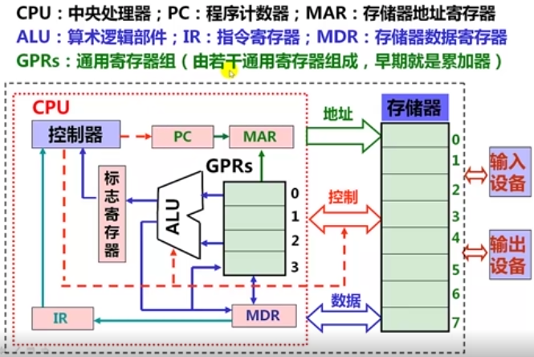

# 计算机系统基础(一)：程序的表示、转换与链接

## 1. 计算机系统概述

**系统思维**

- 从**计算机系统**角度出发分析问题和解决问题
- 首选取决于对计算机系统有多了解，“**知其然并知其所以然**”
  - 高级语言都要转换为机器指令才能在计算机上执行
  - 机器指令是一串0/1序列，能被机器直接理解并执行
  - 计算机系统是模运算系统，字长有限，高位被丢弃
  - 运算器不知道参加运算的是带符号数还是无符号数
  - 在计算机世界，`x*y`可能小于0，(x+y)+z不一定等于x+(y+z)
  - 访问内存需要几十到几百个时钟，而访问磁盘要几百万个时钟
  - 进程具有独立的逻辑控制流和独立的地址空间
  - 过程调用使用栈存放参数和局部变量等，递归过程有大量额外指令，增加时间开销，并可能发生栈溢出

计算机系统抽象层的转换


课程目标：使学生清楚计算机是如何生成和运行可执行文件的！

重点在高级语言以下各抽象层

- C语言程序设计层
  - 数据的机器级表示、运算
  - 语句和过程调用的机器级表示
- 操作系统、编译和链接的部分内容
- 指令集体系结构（ISA）和汇编层
  - 指令系统、机器代码、汇编语言
- 微体系结构及硬件层
  - CPU的通用结构
  - 层次结构存储系统

### 计算机系统基本组成与基本功能

1946年，第1台**通用**电子计算机 `ENIAC`诞生

- `Electronic Numerical Integrator And Computer`电子数字积分计算机
- 由电子真空管组成
- 美国宾夕法尼亚大学研制
- 用于解决复杂弹道计算问题
- 500次加法/s
- 平方、立方、sin、cos等
- 用**十进制**表示信息并运算
- 采用**手动编程**，通过设置开关和插拔电缆来实现

**冯·诺伊曼结构的基本思想**

- 1945年，冯·诺伊曼以“关于EDVAC的报告草案”为题，发表了全新的“**存储程序通用电子计算机方案**”`Electronic Discrete Variable Automatic Computer`
- 1946年，普林斯顿高等研究院(`the Instutute for Advance Study at Princeton, IAS`)开始设计“**存储程序**”计算机，被称为IAS计算机。

|  |  |
| --------------------------------------- | --------------------------------------- |
|  |  |

- 早期，部件之间用**分散方式**相连
- 现在，部件之间大多用**总线方式相连**

冯·诺伊曼结构的主要思想

1. 计算机由**运算器、控制器、存储器、输入设备和输出设备**五个基本部件组成
2. 各基本部件的功能是：
   - 存储器不仅能存放数据，而且也能存放指令，形式上两者没有区别，但计算机应能区分数据还是指令
   - 控制器应能自动取出指令执行
   - 运算器应能进行加/减/乘/除四种基本算术运算，并且也能进行一些逻辑运算和附加运算
   - 操作人员可以通过输入设备、输出设备和主机进行通信
3. 内部以**二进制**表示指令和数据。**每条指令由操作码和地址码两部分组成**。操作码指出操作类型，地址码指出操作数的地址。由一串指令组成程序。
4. 采用“**存储程序**”工作方式

**现代计算机结构模型**

|  |  |
| --------------------------------------- | --------------------------------------- |

**指令和数据**

- **程序启动前**，指令和数据都存放在存储器中，形式上没有差别，都是0/1序列
- 采用“**存储程序**”工作方式：
  - 程序由指令组成，程序被启动后，计算机能自动取出一条一条指令执行，在执行过程中无需人的干预
- **指令执行过程中**，指令和数据被从存储器取到CPU，存放在CPU内的寄存器，指令在IR中，数据在CPR中。
- **指令中需给出的信息：**
  - **操作性质（操作码）**
  - **源操作数1 或/和 源操作数2（立即数、寄存器编号、存储地址）**
  - **目的操作数地址（寄存器编号、存储地址）**
  - 存储地址的描述与**操作数的数据结构**有关！

**计算机的基本组成与基本功能**

- 什么是计算机？
  - 计算机是一种能对数字化信息进行自动、告诉算术和逻辑运算的处理装置
- 计算机的基本部件及功能
  - 运算器（数据运算）：ALU、GPRs、标志寄存器等
  - 存储器（数据存储）：存储阵列、地址译码器、读写控制电路
  - 总线（数据传送）：数据（MDR）、地址（MAR）和控制总线
  - **控制器（控制）：对指令译码生成控制信号**
- 计算机实现的所有任务都是通过执行一条一条指令完成的！

### 程序开发和执行

**最早的程序开发过程**

- 用机器语言编写程序，并记录在纸带或卡片上
  - 穿孔表示0，未穿孔表示1
  - 输入：按钮、开关；
  - 输出：指示灯等
  - 所有信息都是0/1序列

|  |  | 前4位为操作码<br />后4位表示操作地址<br />0101：add<br />0010：跳转<br />0110：sub |
| --------------------------------------- | --------------------------------------- | ---------------------------------------------------------------------------------- |

**汇编语言程序开发过程**

|  |  |
| --------------------------------------- | --------------------------------------- |

- 用**符号**表示跳转位置和变量位置，简化问题
- 于是，汇编语言出现

  - 用**助记符**表示操作码
  - 用**标号**表示位置
  - 用助记符表示寄存器
  - ...
- 汇编语言编写的优点：

  - **不会因为增减指令而需要修改其他指令**
  - 不需记忆指令编码，编写方便
  - 可读性比机器语言强
- 带来新的问题：

  - 人容易了，机器并不认实这些指令
  - **需将汇编语言转换为机器语言**！用**汇编程序**转换

进一步认识机器级语言

- 汇编语言(源)程序由汇编指令构成
- 什么是**汇编指令**？
  - **用助记符和标号来表示的指令（与机器指令一一对应）**
- **指令**又是什么呢？
  - 包含操作码和操作数或其他地址码（机器指令用二进制表示，汇编指令用符号表示）
  - 只能描述：
    - 取（或存一个数）
    - 两个数加（或减、乘、除、与、或等）
    - 根据运算结果判断是否转移执行
  - 
    - `Ld`：Load从存储单元中将数据**加载/装入**到寄存器
    - `St`：Store将寄存器中的数据**存储**到存储单元
- 用**汇编语言**编写复杂程序
  - 需要描述的细节太多！程序会很长！而且在不同结构的机器上就不能运行！
- 结论：
  - **机器语言和汇编语言都是面向机器结构的语言，故它们统称为机器级语言**
  - 用汇编语言比机器语言好，但是，还是很麻烦！

**用高级语言开发程序**

- 随着技术的发展，出现了许多高级编程语言
  - 它们**与具体机器结构无关**
  - **面向算法描述**，比机器语言描述能力强得多
  - 高级语言中一条语句对应几条、几十条甚至几百条指令
  - 有“面向过程”和“面向对象”的语言之分
  - 处理逻辑分为三种结构
    - **顺序结构、选择结构、循环结构**
  - 有两种转换方式：**“编译”和“解释”**
    - **编译程序(Complier)：将高级语言源程序转换为机器级目标程序，执行时只要启动目标程序即可**
    - **解释程序(Interpreter)：将高级语言语句逐条翻译乘机器语言并立即执行，不生成目标文件。**

**Hello程序的启动和执行过程**

经典的 `hello.c` C-源程序

```c
#include <stdio.h>
int main()
{
    printf("hello, world\n");
}

/* GCC+Linux平台中的处理过程 */
/*
                                              printf.o
                                                      \ 链接(ld)
hello.c -----> hello.i -----> hello.s -------> hello.o ---------> hello
源程序   预处理  源程序  编译  汇编语言程序 汇编 可重定向目标程序 可执行目标程序
(文本)   (cpp)  (文本)  (cc1)  (文本)     (as)  (二进制)         (二进制)

*/
```

|  |  |
| --------------------------------------- | --------------------------------------- |


**不同层次语言之间的等价关系**

**任何高级语言程序最终通过执行若干条指令来完成！**

|  |  |
| --------------------------------------- | --------------------------------------- |

**开发和运行程序需要什么支撑？**

- 最早的程序开发很简单
  - 直接输入指令和数据，启动后把第一条指令地址送PC开始执行
- 用高级语言开发程序需要复杂的支撑环境
  - 语言处理程序
    - 需要**编辑器**编写程序
    - 需要一套翻译转换软件处理各类源程序
      - 编译方式：预处理程序、编译器、汇编器、链接器
      - 解释方式：解释程序
    - `语言处理程序 + 语言的运行时系统 = 语言处理系统`
  - 人机接口
    - 需要一个可以执行程序的界面（环境）
      - GUI方式：图形用户界面
      - CUI方式：命令行用户界面
    - `人机接口 + 操作系统内核 = 操作系统`
- 支撑程序开发和运行的环境由**系统软件**提供
- 最重要的系统软件是**操作系统**和**语言处理系统**
- **语言处理系统运行在操作系统之上，操作系统利用指令管理硬件**

### 计算机系统层次结构

**早期计算机系统的层次**

|  |  |  |
| --------------------------------------- | --------------------------------------- | --------------------------------------- |

可以看出：语言的发展是一个不断“**抽象**”的过程，因而，相应的计算机系统也不断有新的层次出现。

- **语言处理系统**包括：各种**语言处理程序（如编译、汇编、链接）**、**运行时系统（如库函数，调试、优化等功能）**
- **操作系统**包括人机交互界面、提供服务功能的内核例程

**计算机系统抽象层的转换**

|  |  |
| ---------------------------------------------- | ---------------------------------------------- |

- 计算机系统抽象层的转换
  - 程序执行结果不仅取决于算法、程序编写，而且取决于语言处理系统、操作系统、ISA、微体系结构
  - 不同计算机课程处于不同层次，必须将各个层次关联起来解决问题
  - **功能转换：上层是下层的抽象，下层是上层的实现。底层为上层提供支撑环境!**
- 计算机系统的不同用户
  - 最终用户工作在由应用程序提供的最上层的抽象层
  - 系统管理员工作在由操作系统提供的抽象层
    - 操作系统通过指令直接对硬件进行编程控制
  - 应用程序员工作在由语言处理系统（主要由编译器和汇编器）的抽象层
    - 语言处理系统建立在操作系统之上
    - 编辑器和汇编器的目标程序由机器级代码组成
  - 系统程序源（实现系统软件）工作在ISA层次，必须对ISA非常了解
    - **ISA处于软件和硬件的交界面（接口）**
    - **ISA是对硬件的抽象**
    - **所有软件功能都建立在ISA之上**

**指令集体系结构（ISA）**

- ISA指 `Instruction Set Architecture`，即**指令集体系结构**，有时简称为**指令系统**
- ISA是一种规约（Specification），规定了如何使用硬件
  - 可执行的指令的集合，包括**指令格式、操作种类**以及每种操作对应的操作数的相应规定
  - 指令可以接受的**操作数的类型**；
  - 操作数所能存放的寄存器组的结构，包括每个**寄存器的名称、编号、长度和用途**；
  - 操作数所能存放的**存储空间的大小和编址方式；**
  - 操作数在存储空间存放时按照**大端还是小端方式存放**
  - 指令获取操作数的方式，即寻址方式；
  - 指令执行过程的控制方式，包括**程序计数器（PC）、条件码定义**等
- ISA在**通用**计算机系统中是必不可少的一个抽象层
  - 没有它，软件无法使用计算机硬件
  - 无它，一台计算机不能称为“通用计算机”
- ISA和计算机组成(Organization，即MicroArchitecture)是何关系？
  - **ISA是计算机组成的抽象**
  - 不同ISA规定的指令集不同，如，IA-32、MIPS、ARM等
  - 计算机组成必须能够实现ISA规定的功能，如提供GPR、标志、运算电路等
  - 同一种ISA可以有不同的计算机组成，如乘法指令可用ALU或乘法器实现

|  |  |
| -------------------------- | -------------------------- |

## 2. 数据的表示和存储

1
